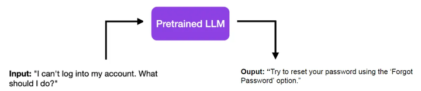
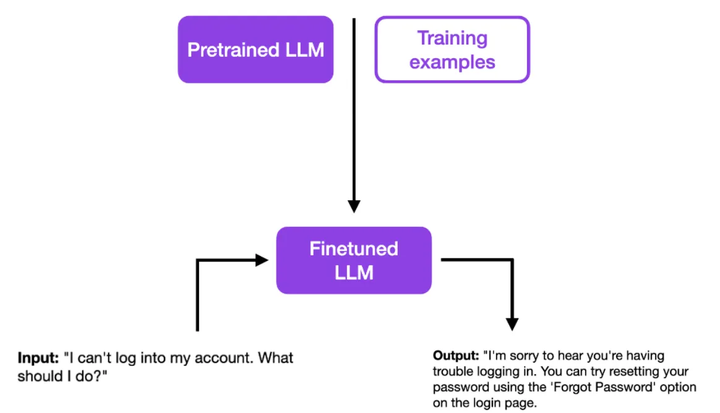

## 有监督微调(SFT)的概念:

SFT（Supervised Fine-Tuning）监督微调是指在源数据集上预训练一个神经网络模型( 无监督方式 )，即源模型。然后创建一个新的神经网络模型，即目标模型。目标模型复制了源模型上除了输出层外的所有模型设计及其参数，训练方式为有监督方式(SFT)。<br>

这里解释下为什么去除了输出层：<br>

在SFT（Supervised Fine-Tuning）监督微调过程中，去除输出层的主要原因是因为源模型和目标模型虽然在大部分结构和参数上是相同的，但它们通常是针对不同的任务设计的。这些任务可能有不同的输出要求，例如不同数量的类别或不同类型的输出（比如分类问题与回归问题）。由于输出层直接负责生成模型的预测输出，它需要根据具体任务的需求来设计。<br>

以下是几个为什么需要去除输出层并根据目标任务重新设计它的主要原因：<br>

1. **不同的输出维度**：源任务和目标任务可能涉及不同数量的预测类别。例如，源模型可能是在一个有100个类别的数据集上训练的，而目标任务可能只有10个类别。因此，输出层的大小（即它的神经元数量）需要根据目标任务的类别数量调整。

2. **不同的任务类型**：源任务可能是分类任务，而目标任务可能是回归任务，或者反之。这种情况下，输出层的设计（包括激活函数的选择）需要根据任务的性质进行调整。

3. **不同的损失函数**：不同的任务可能需要不同的损失函数来优化模型。由于输出层的设计需要与特定的损失函数相兼容，因此在迁移到新任务时可能需要对其进行修改以适应新的损失函数。

4. **提高微调效率**：通过保留预训练模型的大部分参数不变，同时只对输出层（以及可能的几个其他层）进行调整和训练，可以更快地适应新任务，同时减少过拟合的风险。

总的来说，去除输出层并针对新任务进行重新设计是确保模型能够有效学习并针对特定任务进行优化的关键步骤。这种方法允许模型利用预训练中获得的丰富特征表示，同时通过少量的调整来实现对新任务的高效适应。<br>

以BERT模型举例，标准的BERT模型有两个版本：<br>

- **BERT-Base**：包含12层（即12个Transformer编码器）
- **BERT-Large**：包含24层（即24个Transformer编码器）

在进行SFT（Supervised Fine-Tuning）或任何形式的微调时，通常会使用预训练的BERT模型（即所有的Transformer编码器层，包括它们的参数）作为起点。当我们谈论到“去除输出层”时，指的是去除BERT模型顶部的任务特定的输出层，例如用于特定分类任务的线性层。这是因为预训练的BERT模型通常在最后一层输出的基础上添加一个或多个额外的层来适应具体的下游任务（如文本分类、问答等）。<br>

在微调BERT模型时，我们保留所有的Transformer编码器层（无论是12层还是24层），并根据特定任务的需要替换或添加新的输出层。这样做是为了利用BERT在大规模语料库上预训练得到的丰富的上下文依赖的特征表示，同时通过微调来适应特定的下游任务。<br>

## 大模型的有监督微调(SFT):

“有监督微调”意味着使用有标签的数据来调整一个已预训练好的语言模型（LLM），使其更适应某一特定任务。通常LLM的预训练是无监督的，但微调过程往往是有监督的。<br>

当进行有监督微调时，模型权重会根据与真实标签的差异进行调整。通过这个微调过程，模型能够捕捉到标签数据中特定于某一任务的模式和特点。使得模型更加精确，更好地适应某一特定任务。<br>

以一个简单的例子来说，你有一个已经预训练好的LLM。当输入“我不能登录我的账号，我该怎么办？”时，它可能简单地回答：“尝试使用‘忘记密码’功能来重置你的密码。”<br>



这个回答很直接，适用于一般问题，但如果是客服场景，可能就不太合适了。一个好的客服回答应该更有同情心，并且可能不会这么直接，甚至可能包含联系信息或其他细节。这时候，有监督微调就显得非常重要了。<br>



经过有监督微调后，你的模型可以提供更加符合特定指导原则的答案。例如，经过一系列专业的培训示例后，你的模型可以更有同情心地回答客服问题。<br>

SFT的每一条样本一般由两部分组成，也就是prompt（instruction）+ answer，比如：<br>

```txt
prompt: 翻译以下句子: What is pretrain
answer: 什么是预训练
```


## 大模型的预训练(无监督):

在无监督训练，尤其是像GPT这样的语言模型中，训练时的输入和输出遵循一种特定的模式，旨在使模型学习预测下一个词或标记。这里的“词”或“标记”可能是实际的单词、短语或者是文本的一部分，具体取决于模型的设计和预处理阶段的标记化策略。<br>

### 训练时的输入:

训练时的输入通常是一系列的词或标记。例如，考虑一句话：“The cat sits on the”。在训练过程中，这个序列（或其向量化的表示）会作为模型的输入。<br>

### 训练时的输出:

对于上述输入，模型的任务是预测序列中的下一个词或标记。在这个例子中，模型需要预测的输出是“mat”，假设完整的句子是“The cat sits on the mat”。<br>

### 训练过程的细节:

- **自回归模型**: GPT和类似的模型是自回归的，意味着它们在生成下一个词的预测时，会利用之前所有词的信息。模型的每一步预测都基于之前所有步骤的输出。
- **向量化**: 输入和输出在实际训练之前会被转换成向量形式。这通常通过词嵌入来实现，其中每个唯一的词或标记被映射到一个高维空间中的点。
- **训练目标**: 模型训练的目标是最小化实际输出（即数据中的下一个词或标记）和模型预测之间的差异。这通常通过优化损失函数，如交叉熵损失来实现。
- **上下文理解**: 通过这种训练方式，模型不仅学习词汇的统计规律，还学习语言的深层语义和语境信息，使其能够生成连贯且逻辑上合理的文本。

总的来说，无监督训练中的输入是文本序列的一部分，而输出是序列中紧随其后的词或标记。这种训练方式使模型能够捕捉语言的复杂规律和结构，从而在没有明确答案的情况下生成文本或完成其他语言任务。<br>


RLHF是什么？RLHF中的 reward model 是什么？

RLHF（Reinforcement Learning from Human Feedback--从人的反馈中强化学习）是一种结合了多种技术的机器学习方法，旨在通过人类反馈改善强化学习模型的性能和行为。这种方法特别适用于那些难以为其设计明确奖励函数的情境，或者在复杂环境中，直接的奖励信号不足以引导学习过程的场景。RLHF通常包括以下几个步骤或组件：

1. **初始预训练**：使用监督学习对模型进行预训练，以学习模仿人类行为或专家决策的基础能力。这通常涉及到大量的标注数据。

2. **人类反馈**：在预训练之后，模型的输出（比如行为、决策或回答）会被提交给人类评估员进行评价。这些评价可能是简单的好坏评价、更复杂的评分系统，或者是改正和建议。

3. **奖励模型训练**：根据人类的反馈，训练一个奖励模型（reward model）。这个模型的目标是学习预测人类评估员可能给出的反馈或评分。换句话说，奖励模型试图理解人类评估员认为什么样的行为是好的或者是坏的。

4. **强化学习**：最后，使用奖励模型作为奖励信号来进行强化学习。这个步骤中，模型通过尝试不同的行为并根据奖励模型给出的反馈进行学习，以此来优化其决策过程。

在RLHF中，**奖励模型**是核心组件之一。它直接影响了强化学习阶段的效率和效果，因为它提供了一个衡量行为好坏的标准。奖励模型的质量很大程度上取决于人类反馈的数量和质量，以及奖励模型本身的设计和训练过程。通过精细地设计和调整这个过程，研究人员和工程师可以创建出能够在复杂环境中表现出人类般理解和决策能力的强化学习模型。


```markdown
| 方法  | 优点                                          | 缺点                                                       |
| ---- | ------------------------------------------- | --------------------------------------------------------- |
| SFT  | 1. 启动简单，仅需要少量对数据挖掘可以达到训练效果;        | 1. 模型的效果是非常依赖于SFT数据挖掘的质量，天花板取决于SFT数据挖掘的质量;       |
|      | 2. 训练稳定，直接对LLM进行调参，大部分情况下，训练几个epoch就可以达到预期; | 2. 对标注要求高，对一条指令来说，要标注很高质量的回答才是一件非常困难的事情，既耗时又耗力。   |
|      | 3. 易于迁移和扩展于RLHF来说就更理想。                      |                                                           |
| RLHF | 1. 直接利用人类编辑好来进行指导式大模型的训练，使大模型的输出更能满足人们的要求;        | 1. 训练成本大量的显存;                                       |
|      | 2. 在安全性和事实性上，都能有很大的提升。                      | 2. 训练的过程中很不稳定，极易成为的完成PP的训练不是那么容易的事情;                     |
|      |                                             | 3. 除了SFT阶段的数据挖掘，还得标注Reward model的数据。在对技术类指令的过程中，标注更好比较容易，但是想标注比较好多少，又甚至少，这不是件容易的事情。 |
```