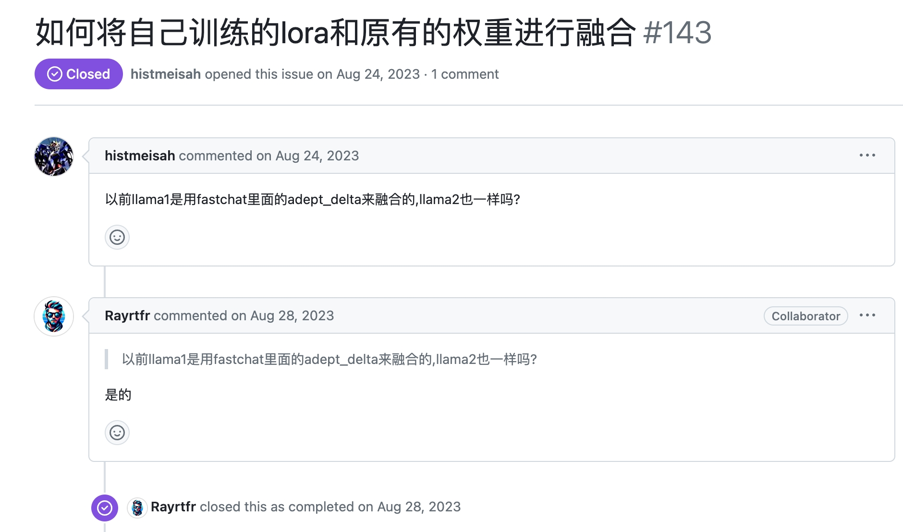

# Llama-Chinese 学习经验记录


## python装饰器`@dataclass`的作用:

### dataclass的常规使用:

`@dataclass` 是 Python 中的一个装饰器，用于自动添加特殊方法，包括 `__init__()`、`__repr__()`、`__eq__()` 和 `__hash__()` 等到用户定义的类中，以减少样板代码。这个装饰器位于 `dataclasses` 模块中，该模块在 Python 3.7 及更高版本中可用。<br>

使用 `@dataclass` 装饰器的主要优点是它允许你定义一个类，专注于类的属性，而不必编写用于初始化属性、比较对象等常见方法的代码。这使得代码更加简洁、易读，并减少了出错的可能性。<br>

下面是一个使用 `@dataclass` 装饰器的例子：<br>

```python
from dataclasses import dataclass

@dataclass
class InventoryItem:
    """Class for keeping track of an item in inventory."""
    name: str
    unit_price: float
    quantity_on_hand: int = 0

    def total_cost(self) -> float:
        return self.unit_price * self.quantity_on_hand
```

在这个例子中，`InventoryItem` 类自动获得了一个 `__init__()` 方法，该方法接受 `name`、`unit_price` 和 `quantity_on_hand` 作为参数（`quantity_on_hand` 有一个默认值）。此外，还自动实现了 `__repr__()` 方法，用于提供对象的字符串表示，以及 `__eq__()` 方法，用于比较两个对象是否相等。<br>

简而言之，`@dataclass` 装饰器是一个非常有用的工具，可以帮助开发者以声明性的方式定义数据持有类，同时减少必须编写的样板代码数量。<br>

### field函数--metadata:

`field` 函数用于为类属性指定额外的配置或元数据。其中 `metadata` 通常用于携带与字段相关的信息，这些信息可能对开发者或其他系统组件在运行时或分析代码时有用。有点类似于注释，但注释在运行时不可用，`metadata` 中的信息在运行时是可以访问的。<br>

```python
from dataclasses import dataclass, field

@dataclass
class Product:
    name: str
    price: float = field(default=100, metadata={"unit": "USD", "description": "Price in US dollars"})

# 访问字段的默认值
default_price = Product.__dataclass_fields__['price'].default
print(default_price)  # 输出: 100

# 访问字段的 metadata
field_info = Product.__dataclass_fields__['price'].metadata
print(field_info['description'])  # 输出: Price in US dollars
```

## 有监督微调(SFT)的概念:

SFT（Supervised Fine-Tuning）监督微调是指在源数据集上预训练一个神经网络模型( 无监督方式 )，即源模型。然后创建一个新的神经网络模型，即目标模型。目标模型复制了源模型上除了输出层外的所有模型设计及其参数，训练方式为有监督方式(SFT)。<br>

这里解释下为什么去除了输出层：<br>

在SFT（Supervised Fine-Tuning）监督微调过程中，去除输出层的主要原因是因为源模型和目标模型虽然在大部分结构和参数上是相同的，但它们通常是针对不同的任务设计的。这些任务可能有不同的输出要求，例如不同数量的类别或不同类型的输出（比如分类问题与回归问题）。由于输出层直接负责生成模型的预测输出，它需要根据具体任务的需求来设计。<br>

以下是几个为什么需要去除输出层并根据目标任务重新设计它的主要原因：<br>

1. **不同的输出维度**：源任务和目标任务可能涉及不同数量的预测类别。例如，源模型可能是在一个有100个类别的数据集上训练的，而目标任务可能只有10个类别。因此，输出层的大小（即它的神经元数量）需要根据目标任务的类别数量调整。

2. **不同的任务类型**：源任务可能是分类任务，而目标任务可能是回归任务，或者反之。这种情况下，输出层的设计（包括激活函数的选择）需要根据任务的性质进行调整。

3. **不同的损失函数**：不同的任务可能需要不同的损失函数来优化模型。由于输出层的设计需要与特定的损失函数相兼容，因此在迁移到新任务时可能需要对其进行修改以适应新的损失函数。

4. **提高微调效率**：通过保留预训练模型的大部分参数不变，同时只对输出层（以及可能的几个其他层）进行调整和训练，可以更快地适应新任务，同时减少过拟合的风险。

总的来说，去除输出层并针对新任务进行重新设计是确保模型能够有效学习并针对特定任务进行优化的关键步骤。这种方法允许模型利用预训练中获得的丰富特征表示，同时通过少量的调整来实现对新任务的高效适应。<br>

以BERT模型举例，标准的BERT模型有两个版本：<br>

- **BERT-Base**：包含12层（即12个Transformer编码器）
- **BERT-Large**：包含24层（即24个Transformer编码器）

在进行SFT（Supervised Fine-Tuning）或任何形式的微调时，通常会使用预训练的BERT模型（即所有的Transformer编码器层，包括它们的参数）作为起点。当我们谈论到“去除输出层”时，指的是去除BERT模型顶部的任务特定的输出层，例如用于特定分类任务的线性层。这是因为预训练的BERT模型通常在最后一层输出的基础上添加一个或多个额外的层来适应具体的下游任务（如文本分类、问答等）。<br>

在微调BERT模型时，我们保留所有的Transformer编码器层（无论是12层还是24层），并根据特定任务的需要替换或添加新的输出层。这样做是为了利用BERT在大规模语料库上预训练得到的丰富的上下文依赖的特征表示，同时通过微调来适应特定的下游任务。<br>

## 大模型的有监督微调(SFT):

“有监督微调”意味着使用有标签的数据来调整一个已预训练好的语言模型（LLM），使其更适应某一特定任务。通常LLM的预训练是无监督的，但微调过程往往是有监督的。<br>

当进行有监督微调时，模型权重会根据与真实标签的差异进行调整。通过这个微调过程，模型能够捕捉到标签数据中特定于某一任务的模式和特点。使得模型更加精确，更好地适应某一特定任务。<br>

以一个简单的例子来说，你有一个已经预训练好的LLM。当输入“我不能登录我的账号，我该怎么办？”时，它可能简单地回答：“尝试使用‘忘记密码’功能来重置你的密码。”<br>


这个回答很直接，适用于一般问题，但如果是客服场景，可能就不太合适了。一个好的客服回答应该更有同情心，并且可能不会这么直接，甚至可能包含联系信息或其他细节。这时候，有监督微调就显得非常重要了。<br>


经过有监督微调后，你的模型可以提供更加符合特定指导原则的答案。例如，经过一系列专业的培训示例后，你的模型可以更有同情心地回答客服问题。<br>

SFT的每一条样本一般由两部分组成，也就是prompt（instruction）+ answer，比如：<br>

```txt
prompt: 翻译以下句子: What is pretrain
answer: 什么是预训练
```


## 大模型的预训练(无监督):

在无监督训练，尤其是像GPT这样的语言模型中，训练时的输入和输出遵循一种特定的模式，旨在使模型学习预测下一个词或标记。这里的“词”或“标记”可能是实际的单词、短语或者是文本的一部分，具体取决于模型的设计和预处理阶段的标记化策略。<br>

### 训练时的输入:

训练时的输入通常是一系列的词或标记。例如，考虑一句话：“The cat sits on the”。在训练过程中，这个序列（或其向量化的表示）会作为模型的输入。<br>

### 训练时的输出:

对于上述输入，模型的任务是预测序列中的下一个词或标记。在这个例子中，模型需要预测的输出是“mat”，假设完整的句子是“The cat sits on the mat”。<br>

### 训练过程的细节:

- **自回归模型**: GPT和类似的模型是自回归的，意味着它们在生成下一个词的预测时，会利用之前所有词的信息。模型的每一步预测都基于之前所有步骤的输出。
- **向量化**: 输入和输出在实际训练之前会被转换成向量形式。这通常通过词嵌入来实现，其中每个唯一的词或标记被映射到一个高维空间中的点。
- **训练目标**: 模型训练的目标是最小化实际输出（即数据中的下一个词或标记）和模型预测之间的差异。这通常通过优化损失函数，如交叉熵损失来实现。
- **上下文理解**: 通过这种训练方式，模型不仅学习词汇的统计规律，还学习语言的深层语义和语境信息，使其能够生成连贯且逻辑上合理的文本。

总的来说，无监督训练中的输入是文本序列的一部分，而输出是序列中紧随其后的词或标记。这种训练方式使模型能够捕捉语言的复杂规律和结构，从而在没有明确答案的情况下生成文本或完成其他语言任务。<br>


## RLHF是什么？RLHF中的 reward model 是什么？

RLHF（Reinforcement Learning from Human Feedback--从人的反馈中强化学习）是一种结合了多种技术的机器学习方法，旨在通过人类反馈改善强化学习模型的性能和行为。这种方法特别适用于那些难以为其设计明确奖励函数的情境，或者在复杂环境中，直接的奖励信号不足以引导学习过程的场景。RLHF通常包括以下几个步骤或组件：

1. **初始预训练**：使用监督学习对模型进行预训练，以学习模仿人类行为或专家决策的基础能力。这通常涉及到大量的标注数据。

2. **人类反馈**：在预训练之后，模型的输出（比如行为、决策或回答）会被提交给人类评估员进行评价。这些评价可能是简单的好坏评价、更复杂的评分系统，或者是改正和建议。

3. **奖励模型训练**：根据人类的反馈，训练一个奖励模型（reward model）。这个模型的目标是学习预测人类评估员可能给出的反馈或评分。换句话说，奖励模型试图理解人类评估员认为什么样的行为是好的或者是坏的。

4. **强化学习**：最后，使用奖励模型作为奖励信号来进行强化学习。这个步骤中，模型通过尝试不同的行为并根据奖励模型给出的反馈进行学习，以此来优化其决策过程。

在RLHF中，**奖励模型**是核心组件之一。它直接影响了强化学习阶段的效率和效果，因为它提供了一个衡量行为好坏的标准。奖励模型的质量很大程度上取决于人类反馈的数量和质量，以及奖励模型本身的设计和训练过程。通过精细地设计和调整这个过程，研究人员和工程师可以创建出能够在复杂环境中表现出人类般理解和决策能力的强化学习模型。


| 方法  | 优点                                          | 缺点                                                       |
| ---- | ------------------------------------------- | --------------------------------------------------------- |
| SFT  | 1. 启动简单，仅需要问答对数据就可以进行训练；<br>2. 训练简单，直接对LLM进行调参，大部分情况下，训练几个epoch就可达到预期；<br>3. 显存资源相比于RLHF来说耗费低。 | 1. 模型的效果非常依赖于SFT数据的质量，天花板取决于SFT数据标注的质量；<br>2. 对标注要求高，对一条指令来说，要标注很高质的回答其实是一件非常困难的事情，既耗时又耗力。|
| RLHF | 1. 直接利用人类偏好来进行指导大模型的训练，使大模型的输出更能满足人们的要求；<br>2. 在安全性和事实性上，都能有很大的提升。| 1. 训练消耗大量的显存；<br>2. 训练的过程中很不稳定，想要成功的完成PPO的训练不是那么容易的事情；<br>3. 除了SFT阶段的数据，还得标注Reward model的数据。在对齐人类偏好的过程中，标谁更好比较容易，但是想标谁比谁好多少，又差多少，这不是件容易的事情。|

## 权重融合:

如何将自己训练的lora和原有的权重进行融合？<br>



## LoRA和QLoRA:

QLoRA比原版LoRA增加了量化机制，使得微调需要的显存更小。<br>

## Llama-Chinese如何int4量化(quantize)，并保存模型:

> "quantize"的读音为 /ˈkwɒn.taɪz/ (美式英语)，意思为 "量化"。

Llama-Chinese项目开发人员: 可以参考以下项目进行量化并保存模型:<br>

```txt
https://github.com/PanQiWei/AutoGPTQ
```

## Llama-Chinese微调支持多轮问答语料吗？

提问者: 示例中的微调语料是一问一答形式的，多轮问答的语料支持吗？如何进行语料构建？<br>

Llama-Chinese项目开发人员: 可以支持多轮语料，就将单轮的拼接在一起就可以,例如:<br>

```txt
<s>Human: 内容1\n</s><s>Assistant: 内容2\n</s><s>Human: 内容3\n</s><s>Assistant: 内容4\n</s>
```

## Llama-Chinese怎样实现stream流式输出？

Llama-Chinese项目开发人员: 可以的，参考这个:<br>

```txt
https://github.com/FlagAlpha/Llama2-Chinese/blob/main/examples/chat_gradio.py
```

## 针对Llama-Chinese想用自己领域语料全量预训练需要怎么做:

Llama-Chinese项目开发人员: 可以参考hf 上的train clm，网址如下: <br>

```txt
https://github.com/huggingface/transformers/blob/main/examples/pytorch/language-modeling/run_clm.py
```

## SHA 256对比:

提问者: "下载了国内地址的7b模型后, 用最新的llama.cpp convert会出错, 怀疑是下载过程中出错了, 能否提供下各个模型的sha256 方便对比"，这句话中的 "sha256" 是什么意思？<br>

解答:<br>

"sha256"指的是SHA-256，即安全哈希算法（Secure Hash Algorithm）256位版本的缩写。它是一种加密哈希函数，可以将任意长度的数据转换成一个固定长度（256位、32字节）的唯一散列值（或哈希值）。这个散列值通常用一个64位的十六进制字符串来表示。<br>

在文件下载和软件分发中，SHA-256常被用来验证数据完整性。提供文件的SHA-256散列值可以帮助用户检查下载的文件是否未经修改且未损坏，从而确保下载的文件是原始的、可信的。用户可以在本地计算下载文件的SHA-256值，并将其与官方网站提供的SHA-256散列值进行比较。如果两个散列值匹配，就意味着文件完整且未被篡改；如果不匹配，则文件可能在传输过程中被损坏或被恶意修改。<br>